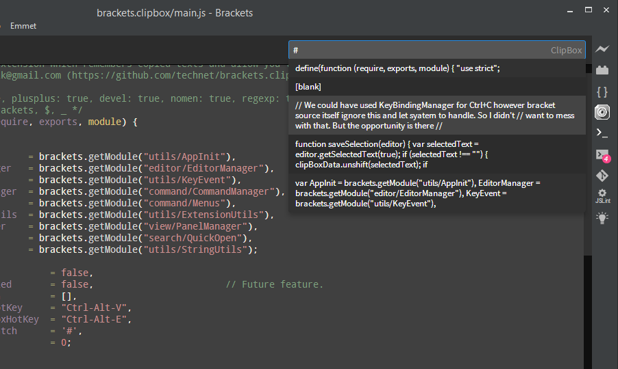

Brackets ClipBox (Clipboard History)
=======================

Another simple extension which remembers last few copied texts and allow you to access them and paste back whenever needed. This will capture <kbd>Ctrl</kbd>+<kbd>C</kbd> keystrokes and store selected text in its own internal array. Then you can invoke the hot-key <kbd>Ctrl</kbd>+<kbd>Alt</kbd>+<kbd>V</kbd> to launch `QuickOpen` window, select and paste back.

> This extension won't block your usual editor usage, but it seamlessly keeps history of copied texts for future reference.

There are some limitations, but considering 99% of common usage, these limitations won't be significant.

### Usage

* Use <kbd>Ctrl</kbd>+<kbd>C</kbd> as usual to copy texts and continue work on editor. In background `ClipBox` will capture texts and store.

* Hit <kbd>Ctrl</kbd>+<kbd>Alt</kbd>+<kbd>V</kbd> to invoke `QuickOpen` box to see the history of copied texts, and use <kbd>Up</kbd> and <kbd>Down</kbd> arrow keys to navigate through the entries. Then hit <kbd>Enter</kbd> to paste the selected entry back to the editor.

* Hit <kbd>Ctrl</kbd>+<kbd>Alt</kbd>+<kbd>E</kbd> to clear the stored history.

* This will store maximum of 10 history entries.

### Limitations

* **No Cut, only Copy** In ideal environment this should capture both `Copy` and `Cut` functionality. However I implemented this just by handling the key event and then accessing the editor. During `Copy` operation selected text is available on the editor so we can capture a copy of it. But in the event of `Cut` system has already removed selected text from the editor so unless you directly access clipboard we don't have access to this text. I'm still not sure how to access clipboard directly using Javascript in this environment so left it for future enhancements.

	* I could have used direct key binding using `KeyBindingManager` to capture both <kbd>Ctrl</kbd>+<kbd>C</kbd> and <kbd>Ctrl</kbd>+<kbd>X</kbd> commands, then I would have implemented both scenarios successfully. Problem is that event brackets editor itself avodes [ignoreCommand](https://github.com/adobe/brackets/blob/master/src/editor/EditorCommandHandlers.js#L1106) handling these native commands by itself. Main thing is I just wanted to implement this as a supplementary feature without breaking most primary functionality that any editor has.
	
	
* **Won't handle menu action** This won't respond if you copy using the `Edit -> Copy` menu option. Because with my knowledge I have so far related to brackets, I cannot register another event handler to same command, so I don't know how to know whether user clicks on this menu item.   

### Design Considerations

* Didn't want to introduce new hot key to make this extension usable, which will hinder the normal editor usage, instead you can use usual <kbd>Ctrl</kbd>+<kbd>C</kbd> key combination and extension will capture and build its own clipboard.

* Didn't use `KeyBindingManaer` to capture the keyevent mainly because these are primary key combinations for any editor so didn't want to mess with them.

* Utilized the `QuickOpen` plugin to show the stored clipboard history as it is easy to navigate and select history item.

* Even though it uses `QuickOpen` it doesn't do any filtering mainly because this isn't a search feature. (probably in future releases)

### Future Enhancements

* Capture both `Cut` and `Copy` operations. 
* Handle `Edit -> Cut` and `Edit -> Copy` menu actions.
* Filter entries by search string.